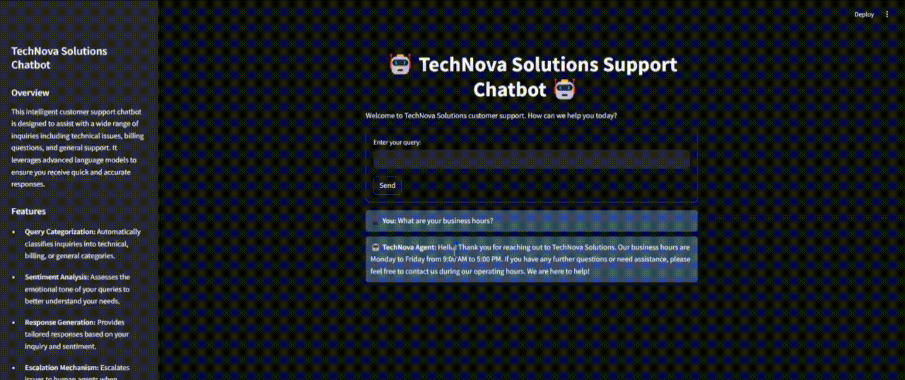
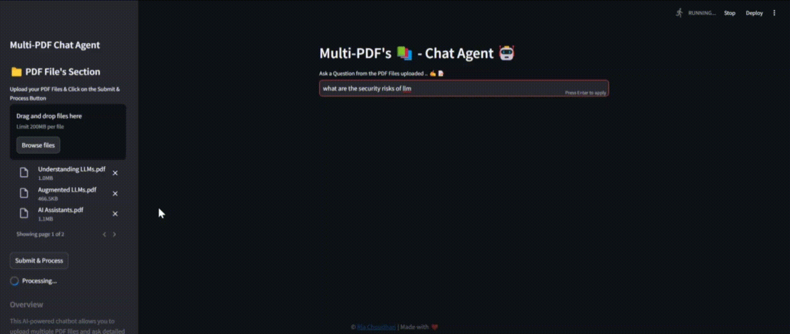

# ✨NexusAI✨

<div align="center">
  
</div>

Welcome to **NEXUSAI: The AI Agents Suite** – a collection of powerful, AI-driven agents designed to revolutionize how you interact with technology. This repository hosts a diverse set of agents, each tailored to a specific domain ranging from customer support and healthcare to education, travel, and more.

## Agents Overview 🌟

| **Agent Name**                   | **Description**                                                                                                                                                              |
|----------------------------------|------------------------------------------------------------------------------------------------------------------------------------------------------------------------------|
| **🤖 24/7 AI Chatbot**           | A round-the-clock conversational agent that engages users and provides instant customer support.                                                                              |
| **🩺 AI Health Assistant**       | An intelligent virtual health companion offering preliminary health advice and medical information to guide your well-being.                                                   |
| **🧑‍🏫 Virtual Tutor**           | Your personal educational assistant that explains complex concepts and answers questions, enhancing your learning experience across multiple subjects.                     |
| **📊 AI Data Visualization Agent** | Transforms raw data into interactive and insightful visualizations to help uncover trends and patterns quickly and effectively.                                               |
| **📚 Multi-PDFs Chatapp**        | Enables you to upload multiple PDF files and ask detailed questions about their content, extracting answers directly from your documents.                                      |
| **💼 genAI_career_assistant**    | Provides tailored career guidance, resume tips, and job search strategies powered by cutting-edge generative AI.                                                              |
| **🌱 Smart Farming Assistant**   | A smart agriculture assistant designed for farmers, offering crop management advice, weather insights, and smart farming techniques to boost productivity.                |
| **✈️ AI Travel Agent**           | Delivers comprehensive travel information—including flights, hotels, and itinerary planning—and even lets you email your travel plan directly.                                |
| **🖼️🗣️ Image to Speech GenAI Tool** | Converts images into engaging audio narratives by transforming visual content into descriptive speech, ideal for accessibility and creative storytelling.                     |
| **📈 AI Lead Generation**        | Automates the process of generating high-quality leads by extracting and organizing valuable user data into Google Sheets for easy follow-up and analysis.                  |

---

## Installation 🔧

1. **Clone the Repository**  
   ```git clone https://github.com/Ria2810/ai-agents-suite.git/```

2. **Navigate to the Project Directory**  
   ```cd NexusAI```

3. **Install the Dependencies**  
   ```pip install -r requirements.txt```

---

## Configuration ⚙️

Before running the application, create a `.env` file in the project root and add the following environment variables:

```env
OPENAI_API_KEY=your_openai_api_key
TOGETHER_API_KEY=your_together_api_key
GOOGLE_API_KEY=your_google_api_key
HUGGING_FACE=your_hugging_face_api_key
SERPAPI_API_KEY=your_serpapi_api_key
COMPOSIO_API_KEY=your_composio_api_key
FIRECRAWL_API_KEY=your_firecrawl_api_key
LANGCHAIN_API_KEY=your_langchain_api_key
LANGCHAIN_TRACING_V2=your_langchain_tracing_v2
LANGCHAIN_PROJECT=your_langchain_project
FROM_EMAIL=your_from_email
SMTP_SERVER=your_smtp_server
SMTP_PORT=your_smtp_port
SMTP_USERNAME=your_smtp_username
SMTP_PASSWORD=your_smtp_password
EMAIL_SUBJECT=your_email_subject
```
Replace the placeholder values with your actual API keys and credentials.

---

## Usage 🚀

Run the application using Streamlit with the following command:

```streamlit run app.py --server.port 8500```

Each agent is accessible via its dedicated section in the Streamlit UI. Follow the on-screen instructions to interact with the agent you’re interested in.

---

## Demo Videos📽️
- **Main Dashboard Page**:


- **24/7 Customer Service Agent**:


- **Health Assistant**:


- **Travel Agent**:


- **Multi-PDFs ChatApp**:


- **AI Lead Generation**:


---

## Contributing 🤝

Contributions are welcome! Feel free to fork this repository and submit pull requests. When contributing, please follow the code style guidelines and ensure your changes are well documented.

---

## License 📄

This project is licensed under the MIT License. See the [LICENSE](LICENSE) file for further details.

---

## Contact 📧

For any questions or support, please open an issue in the repository or contact [Ria Choudhari](mailto:riachoudhari9@gmail.com).

---

*Made with ❤️ by [Ria Choudhari](https://github.com/Ria2810)*
*Contributor [Siddarama mallanna manur ](https://github.com/siddarammanur656)*
